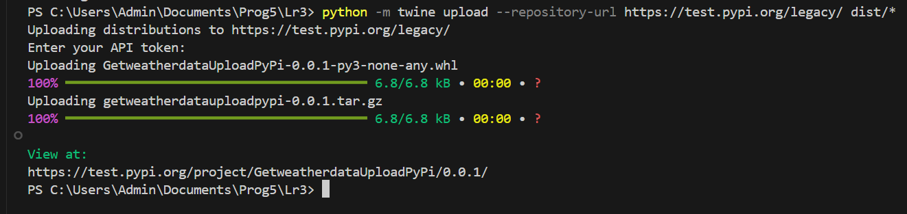

# Лабораторная работа 3 "Создание своего пакета. Публикация на PyPi"
## Описание
Этот проект предоставляет возможность получать данные о погоде для заданного города с помощью API OpenWeatherMap. Программа выполняет HTTP-запросы к API и возращает информацию о погоде в формате JSON.

# Регистрация
Для использования API OpenWeatherMap необходимо зарегистрироваться на сайте OpenWeatherMap и получить API-ключ

Для публикации на Test PyPi:
1. Зарегистрироваться на Test PyPi
2. Получить API-токен для выгрузки пакета
# Ход работы
Шаг 1. Установка инструментов
Для публикации проекта на Test PyPi необходимо установить следующие инструменты:
```
pip install setuptools wheel twine
```
Шаг 2. Написать Setup.py
Шаг 3. Сборка проекта и выгрузка на Test PyPi
Сборка:
```
python setup.py sdist bdist_wheel
```
Выгрузка:
```
twine upload --repository-url https://test.pypi.org/legacy/ dist/*
```
или 
```
python -m twine upload --repository-url https://test.pypi.org/legacy/ dist/*
```
# Результат:

https://test.pypi.org/project/GetweatherdataUploadPyPi/0.0.1/


