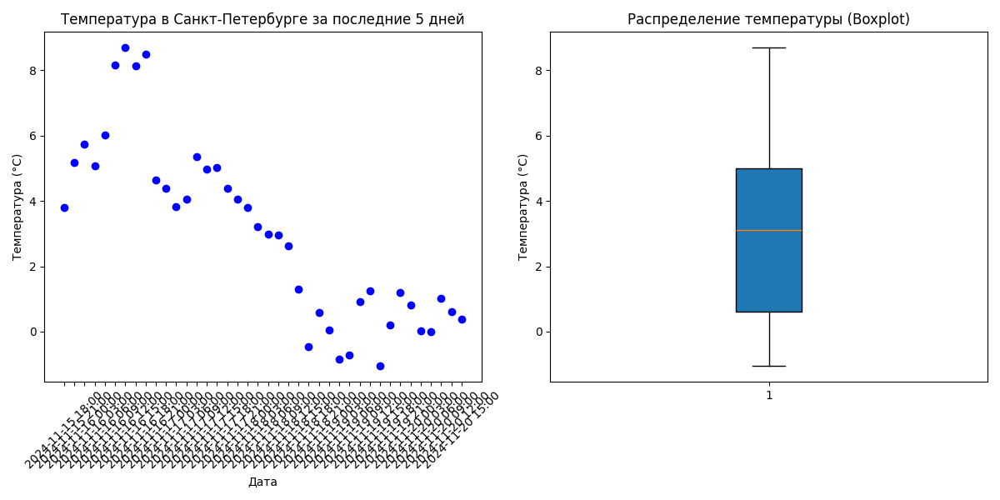

# Лабораторная работа 8: Визуализация данных о погоде с помощью matplotlib

## Описание работы

Цель лабораторной работы - научиться обрабатывать и визуализировать данные, полученные с помощью API (На примере сервиса OpenWeatherMap). В рамках работы необходимо получить данные о погоде за последние 5 дней для города Санкт-Петербург, а затем визуализировать их с помощью диаграмм.

Лабоаторная работа состоит из двух основных частей:

1. Получение данных с помощью API.
2. Визуализация данных.

## Этап 1: Получение данных

Для получения данных о погоде используется API OpenWeatherMap. В коде используется метод `getweather`, который отправляет запрос на сервер и получает данные о погоде в формате JSON.

Пример получения данных о погоде:

[Weather_data_fetcher.py](Weather_data_fetcher.py)

Данные возвращаются в формате JSON и содержат информацию о температуре на различные даты.

## Этап 2: Визуализация данных

Полученные данные визуализируются с помощью библиотеки ```matplotlib```. Для этого испольуется функция ```visualise_data```, которая строит два графика:

1. Диаграмму рассеяния (scatterplot) для отображения температур по датам.
2. Boxplot для отображения распределения температуры.

Пример кода для визуализации:

[Weather-visualiser.py](Weather-visualizer.py)

Этот код рисует два графика: диаграмму рассеяния температур по времени и boxplot для температур.

## Результаты

Проект визуализирует данные о температуре в Санкт-Петербурге за последние 5 дней, показывая как графически, так и статически(с помощью boxplot) изменение температуры.


